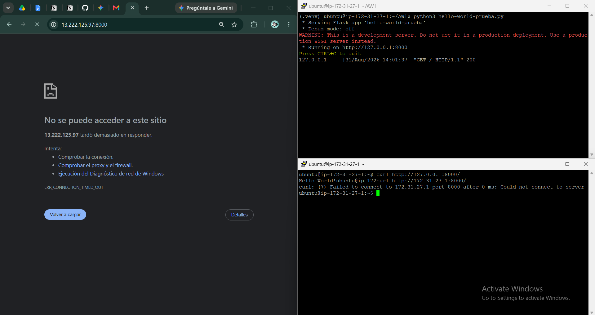

# Despliegue en EC2

### 5.2 Comprobar
Comprobar acceso al servidor ec2:

- `curl http://127.0.0.1:8000/` (dentro del servidor) → respondió `Hello World!` sin problema.
- `curl http://172.31.27.1:8000/` (IP privada, desde otra sesión SSH) → rechazo inmediato (`Could not connect to server`, 0 ms). El paquete llegó a la máquina, pero como el proceso no escucha en esa interfaz, nadie lo atendió.
- Navegador a `http://13.222.125.97:8000/` → no rechazó, quedó esperando y expiró por tiempo (`ERR_CONNECTION_TIMED_OUT`). Esto es distinto al caso anterior: acá el paquete probablemente ni siquiera llegó a la instancia, lo que apunta a que el grupo de seguridad de EC2 está bloqueando el puerto 8000 desde afuera.

Por un lado, Flask escucha solo en `127.0.0.1` (loopback), no en todas las interfaces de la máquina, así que ni siquiera la IP privada responde desde otra sesión. Por otro lado, el grupo de seguridad de EC2 no tiene abierto el puerto 8000 hacia el exterior, así que aunque corrigiera el punto 1, el navegador seguiría sin poder llegar desde internet.

### 5.3 Diagnóstico
`0.0.0.0` le dice al proceso que escuche en todas las interfaces de red que tenga esta máquina (ya sea la de loopback, la privada o cualquier otra). Si en cambio pusieras literalmente `172.31.27.1` (IP privada), el proceso quedaría atado únicamente a esa interfaz específica, y dejaría de responder por loopback, por ejemplo. Además esa IP privada es asignada por DHCP y puede cambiar si la instancia se reinicia — atarse a un valor fijo es frágil. `0.0.0.0` es la forma correcta y portable de que todas las interfaces estén disponibles.

### 7.2 El Dockerfile
**1. ¿Qué copia exactamente COPY ./site/?**

Copia todo el contenido del directorio actual (`.`) al directorio site (`/site/`) con excepción de lo incluido en `.dockerignore`.

**2. ¿Qué pasaría si tuviera un .pem en el directorio?**

En el archivo `.dockerignore` está incluido el tipo de archivo `*.pem`, por lo tanto si hay un archivo `.pem` este no se incluirá en la construcción de la imagen.

**3. El Dockerfile declara EXPOSE 5001 pero la aplicación escucha en el 8000: ¿cuál de los dos manda?**

`EXPOSE` es solo documentación, no publica ni redirige ningún puerto, lo que conecta el host con el contenedor es el `-p` en el comando `docker run`.